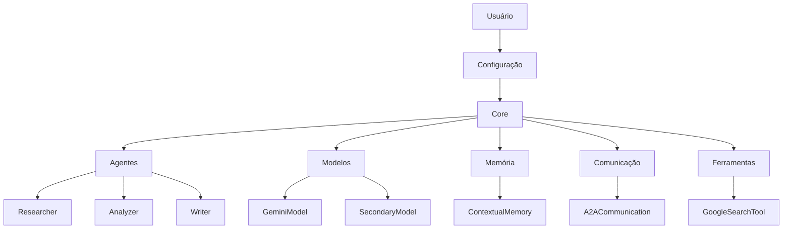

# Arquitetura do Mangaba.AI

Este documento descreve a arquitetura do sistema Mangaba.AI e seus principais componentes.

## Visão Geral

O Mangaba.AI é construído com uma arquitetura modular que permite a criação e gerenciamento de agentes de IA autônomos. A arquitetura é composta pelos seguintes componentes principais:

1. **Sistema de Agentes**
2. **Sistema de Modelos**
3. **Sistema de Memória**
4. **Sistema de Comunicação**
5. **Sistema de Ferramentas**

## Diagrama de Arquitetura

## Componentes Principais

### 1. Sistema de Agentes

O sistema de agentes é responsável por gerenciar os diferentes tipos de agentes e suas interações:

- **Researcher**: Agente especializado em pesquisa e coleta de informações
- **Analyzer**: Agente especializado em análise de dados e resultados
- **Writer**: Agente especializado em geração de relatórios e documentos

Cada agente possui:
- Um modelo de IA principal
- Um modelo secundário opcional
- Um conjunto de ferramentas
- Um sistema de memória
- Capacidade de comunicação com outros agentes

### 2. Sistema de Modelos

O sistema de modelos gerencia os diferentes modelos de IA utilizados:

- **GeminiModel**: Modelo principal baseado no Gemini
- **SecondaryModel**: Modelo secundário para tarefas específicas

Características:
- Suporte a múltiplos modelos
- Configuração flexível
- Tratamento de erros e retentativas
- Execução assíncrona

### 3. Sistema de Memória

O sistema de memória mantém o contexto das interações:

- **ContextualMemory**: Armazena informações contextuais
- Memória individual por agente
- Memória compartilhada entre agentes
- Limpeza automática de dados antigos

### 4. Sistema de Comunicação

O sistema de comunicação gerencia a interação entre agentes:

- **A2ACommunication**: Sistema de mensagens entre agentes
- Mensagens assíncronas
- Fila de mensagens
- Time-to-live para mensagens
- Priorização de mensagens

### 5. Sistema de Ferramentas

O sistema de ferramentas fornece funcionalidades adicionais:

- **GoogleSearchTool**: Busca de informações
- Interface padronizada
- Execução assíncrona
- Tratamento de erros

## Fluxo de Execução

1. **Inicialização**:
   - Carregamento da configuração
   - Inicialização dos modelos
   - Criação dos agentes

2. **Execução de Tarefas**:
   - Recebimento da tarefa
   - Seleção do agente apropriado
   - Execução da tarefa
   - Comunicação entre agentes
   - Armazenamento de resultados

3. **Finalização**:
   - Consolidação de resultados
   - Limpeza de recursos
   - Geração de relatórios

## Considerações de Design

### Escalabilidade
- Arquitetura modular
- Componentes independentes
- Execução assíncrona

### Manutenibilidade
- Código bem documentado
- Interface clara entre componentes
- Testes automatizados

### Extensibilidade
- Fácil adição de novos agentes
- Fácil adição de novas ferramentas
- Fácil integração de novos modelos

## Próximos Passos

1. Implementação de novos tipos de agentes
2. Adição de mais ferramentas
3. Melhoria do sistema de memória
4. Otimização da comunicação entre agentes
5. Implementação de testes automatizados 