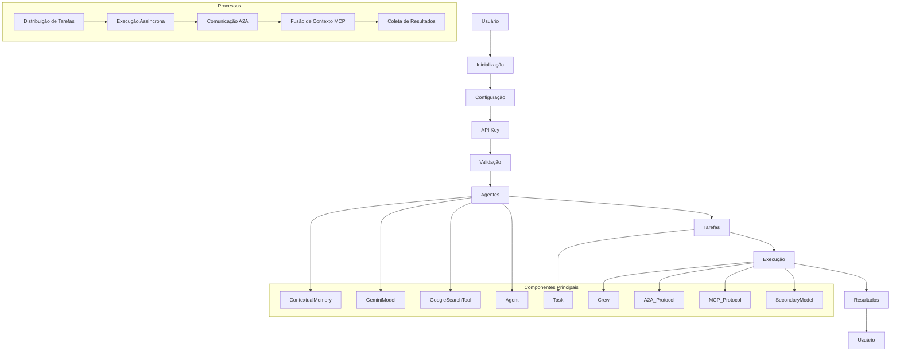

# Fluxo de Trabalho do Mangaba.AI

Este documento descreve o fluxo de trabalho do Mangaba.AI.

## Visão Geral

O fluxo de trabalho consiste em:

1. **Inicialização**: Configuração do sistema
2. **Criação de Agentes**: Definição de agentes especializados
3. **Criação de Tarefas**: Definição de tarefas para os agentes
4. **Execução**: Processamento das tarefas
5. **Resultados**: Coleta e processamento dos resultados

## Fluxograma



## Configuração

O fluxo de trabalho é configurado através do arquivo de configuração:

```json
{
    "workflow": {
        "max_agents": 10,
        "max_tasks": 100,
        "timeout": 3600,
        "retry_attempts": 3
    },
    "agents": {
        "max_concurrent_tasks": 5,
        "task_timeout": 300
    },
    "communication": {
        "max_messages": 1000,
        "message_ttl": 3600
    },
    "context_fusion": {
        "max_contexts": 10,
        "context_ttl": 1800
    }
}
```

## Implementação

### Inicialização

```python
from mangaba_ai import MangabaAI

# Inicializa o sistema
mangaba = MangabaAI("config.json")

# Valida API Key
if not await mangaba.validate_api_key():
    raise Exception("API Key inválida")
```

### Criação de Agentes

```python
# Cria agentes
researcher = mangaba.create_agent(
    name="pesquisador",
    role="Pesquisador",
    goal="Realizar pesquisas"
)

analyst = mangaba.create_agent(
    name="analista",
    role="Analista",
    goal="Analisar dados"
)
```

### Criação de Tarefas

```python
# Cria tarefas
task1 = mangaba.create_task(
    description="Pesquisar sobre IA",
    agent=researcher
)

task2 = mangaba.create_task(
    description="Analisar resultados",
    agent=analyst,
    dependencies=[task1]
)
```

### Execução

```python
# Executa tarefas
results = await mangaba.execute([task1, task2])

# Processa resultados
for task, result in results.items():
    print(f"Tarefa: {task}")
    print(f"Resultado: {result}\n")
```

## Protocolos

### A2A (Agent-to-Agent)

```python
# Envia mensagem
await researcher.send_message(
    receiver="analista",
    content="Dados coletados",
    priority=2
)

# Recebe mensagens
messages = await analyst.receive_messages()
```

### MCP (Multi-Context Protocol)

```python
# Adiciona contexto
await mangaba.add_context(
    agent=researcher,
    context="Dados de pesquisa",
    ttl=1800
)

# Fusão de contexto
fused_context = await mangaba.fuse_context(
    agents=[researcher, analyst],
    prompt="Analisar dados"
)
```

## Melhores Práticas

1. **Configuração**
   - Valide API Key
   - Ajuste parâmetros
   - Documente configurações

2. **Agentes**
   - Defina papéis claros
   - Estabeleça objetivos
   - Gerencie recursos

3. **Tarefas**
   - Seja claro na descrição
   - Defina dependências
   - Gerencie prioridades

4. **Execução**
   - Monitore progresso
   - Gerencie erros
   - Documente resultados

5. **Comunicação**
   - Seja claro nas mensagens
   - Use prioridades adequadas
   - Gerencie contexto

## Solução de Problemas

### Problemas Comuns

1. **API Key Inválida**
   - Verifique chave
   - Confirme limites
   - Monitore uso

2. **Agentes Bloqueados**
   - Verifique recursos
   - Confirme permissões
   - Monitore tarefas

3. **Tarefas Pendentes**
   - Verifique dependências
   - Confirme prioridades
   - Monitore progresso

4. **Comunicação Lenta**
   - Otimize mensagens
   - Gerencie recursos
   - Monitore desempenho

### Dicas de Otimização

1. **Configuração**
   - Ajuste parâmetros
   - Otimize recursos
   - Documente mudanças

2. **Execução**
   - Gerencie tarefas
   - Monitore progresso
   - Trate erros

3. **Comunicação**
   - Otimize fluxo
   - Gerencie contexto
   - Documente protocolos

4. **Monitoramento**
   - Acompanhe métricas
   - Registre erros
   - Documente soluções 